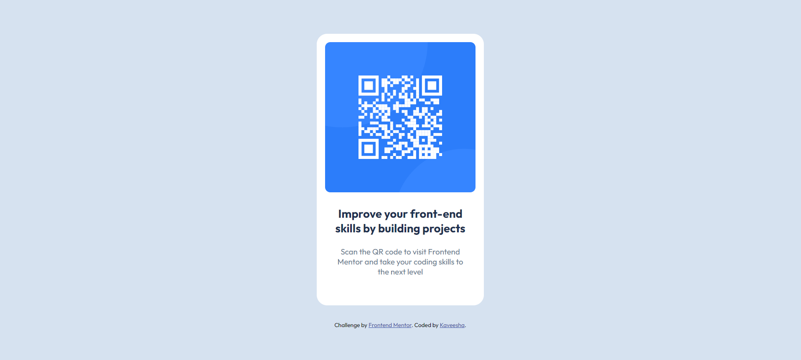

# Frontend Mentor - QR code component solution

This is a solution to the [QR code component challenge on Frontend Mentor](https://www.frontendmentor.io/challenges/qr-code-component-iux_sIO_H). Frontend Mentor challenges help you improve your coding skills by building realistic projects. 

## Table of contents

- [Overview](#overview)
  - [Screenshot](#screenshot)
  - [Links](#links)
- [My process](#my-process)
  - [Built with](#built-with)
  - [What I learned](#what-i-learned)
  - [Continued development](#continued-development)
- [Author](#author)

## Overview

### Screenshot




### Links

- Solution URL: [https://github.com/kaveeshagim/qr-code-component](https://github.com/kaveeshagim/qr-code-component)
- Live Site URL: [https://kaveeshagim.github.io/qr-code-component/](https://kaveeshagim.github.io/qr-code-component/)

## My process

### Built with

- Semantic HTML5 markup
- CSS custom properties
- Flexbox
- Mobile-first workflow

### What I learned

Through this project i learned how to create the skeleton of my design using HTML div tags and using CSS to create a responsive design

To see how you can add code snippets, see below:

```html
<div class="main">
  <div class="heading-component">
    <p>Improve your front-end skills by building projects</p>
  </div>
  <div class="body-component">
    <p>Scan the QR code to visit Frontend Mentor and take your coding skills to the next level</p>
  </div>
</div>
```
```css
.container {
    position: relative;
    top: 0;
    left: 0;
    max-width: 320px;
    width: 100%;
}
```

### Continued development

I want to further develop my CSS skills, especially regarding flexbox and grids for a responsive design.

## Author

- Github - [https://github.com/kaveeshagim](https://github.com/kaveeshagim)
- Frontend Mentor - [@kaveeshagim](https://www.frontendmentor.io/profile/kaveeshagim)
- Instagram - [@codingwcn](https://www.instagram.com/codingwcn)

